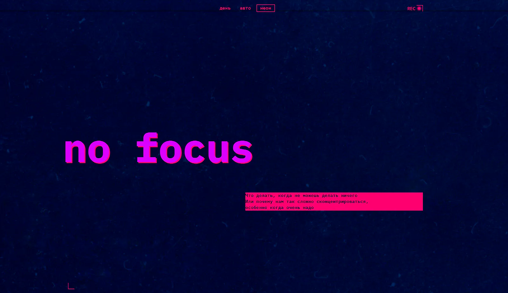

# 🏛️ Сложно сосредоточиться

<div align="center">


</div>

### Превью проекта



### Интерфейс сайта

[🔗 Посмотреть демо](https://annenkov-konstantin.github.io/slozhno-sosredotochitsya-fd/) • [💻 Исходный код](https://github.com/Annenkov-Konstantin/slozhno-sosredotochitsya-fd)

Адаптивная одностраничная статья о концентрации внимания с тремя темами оформления: светлой, тёмной и автоматической (на основе системных настроек пользователя). Проект выполнен в неоновом стиле с акцентом на типографику и декоративные элементы.

## 📄 Содержание страницы

- **Header** — заглавие "no focus", подзаголовок с описанием темы, меню переключения темы
- **Почему сосредоточиться так сложно** — про многозадачность и дофамин
- **Что снижает концентрацию** — многозадачность, еда, гаджеты
- **Как концентрироваться лучше** — 5 практических советов
- **Галерея изображений** — адаптивная сетка с картинками в стиле "можно в картинках?"
- **Footer** — заглавие "focus" с декоративными элементами

## 🛠 Стек технологий

- **Вёрстка:** HTML5, CSS3 (Grid, Flexbox, Custom Properties)
- **Шрифты:** IBM Plex Mono (Regular, Bold) в формате WOFF
- **Изображения:** PNG с ленивой загрузкой (`loading="lazy"`)
- **JavaScript:** Vanilla JS (переключение тем, сохранение в localStorage)
- **Оптимизация:** CSS-переменные, `clamp()` для адаптивной типографики, `prefers-color-scheme`

## ✨ Ключевые особенности

### 🎨 Три темы оформления

- **Светлая ("День")** — мягкие розовые тона (#ffeef6, #ff8dcb)
- **Тёмная ("Неон")** — неоновые акценты на тёмно-синем фоне (#010028, #ff0070, #db00ff)
- **Автоматическая ("Авто")** — определяется через `@media (prefers-color-scheme)`

Переключение темы реализовано через классы на `<html>` (`theme-light`, `theme-dark`) с переопределением CSS-переменных. Выбор пользователя сохраняется в `localStorage`.

### 📐 Адаптивная вёрстка

Три брейкпоинта с использованием современных CSS-техник:

- **Мобильные:** < 768px — одноколоночная раскладка
- **Планшеты:** ≥ 768px — двухколоночный CSS Grid для секций, мозаичная галерея
- **Десктоп:** ≥ 1024px — горизонтальное меню тем, расширенные отступы

### 🔤 Адаптивная типографика

Использование `clamp()` для плавного изменения размеров шрифтов:

```css
.most__deco-titles {
  font-size: clamp(7.25rem, 7.0115rem + 1.0178vw, 7.5rem);
}
```

### 🎭 Декоративные элементы

- Уголки в стиле "decorated zone" — абсолютное позиционирование через ::before/::after
- Индикатор REC — появляется только в тёмной теме (--display-decorated-element)
- Тени текста — неоновые text-shadow для заголовков
- Фон с background-attachment: fixed — эффект параллакса

### ♿ Доступность (a11y)

- Семантическая разметка:

```
<header>, <main>, <footer>, <article>, <aside>, <nav>
```

- Активная кнопка темы получает disabled для предотвращения повторных кликов
- aria-hidden="true" для декоративных элементов
- focus-visible стили для клавиатурной навигации
- Атрибуты alt у всех изображений

### ⚡ Производительность

- Ленивая загрузка изображений — loading="lazy" для всех картинок в галерее
- CSS-переменные — единый источник цветов для всех тем
- Разделение CSS — variables.css, globals.css, style.css, dark.css, light.css
- font-display: swap — избегаем невидимого текста при загрузке шрифтов

## 🚀 Запуск

Проект является статическим сайтом. Варианты запуска:

### Самый простой способ

Просто открой index.html в любом современном браузере (двойной клик по файлу).

### Через Live Server (VS Code)

1. Установи расширение Live Server
2. Кликни правой кнопкой на index.html → "Open with Live Server"

## 📁 Структура проекта

```
slozhno-sosredotochitsya-fd/
├── index.html              # Главная страница
├── fonts/
│   ├── IBMPlexMono-Bold.woff
│   ├── IBMPlexMono-Regular.woff
│   └── fonts.css           # Подключение шрифтов
├── images/                 # Изображения, favicon, обложки тем
├── styles/
│   ├── globals.css         # Сброс и базовые стили
│   ├── variables.css       # CSS-переменные и дефолтная тема
│   ├── style.css           # Основные стили компонентов
│   ├── dark.css            # Стили тёмной темы
│   └── light.css           # Стили светлой темы
├── scripts/
│   └── script.js           # Логика переключения тем
└── README.md
```

## 🧠 Архитектурные решения

- Разделение CSS по темам
- Каждая тема вынесена в отдельный файл (dark.css, light.css) и переопределяет CSS-переменные из variables.css.

Это позволяет:

- Легко добавлять новые темы
- Избежать дублирования кода
- Чётко видеть, какие цвета относятся к какой теме

### ⚙️ Механизм переключения тем

- При загрузке страницы initTheme() проверяет localStorage на наличие сохранённой темы
- Если тема не найдена — используется системная настройка через prefers-color-scheme

При клике на кнопку темы вызывается setTheme(), который:

- Очищает все классы у <html>
- Добавляет класс theme-{name}
- Сохраняет выбор в localStorage
- Активная кнопка получает класс \_active и атрибут disabled

### 🖼️ CSS Grid для галереи

Мозаичная раскладка изображений реализована через CSS Grid с grid-column и grid-row:

```
.sunset { grid-column: 1 / span 2; grid-row: 1 / auto; }
.ice-cream { grid-column: 3 / auto; grid-row: 1 / span 2; }
.tape { grid-column: 1 / auto; grid-row: 2 / span 2; }
```

## 🔮 Возможные улучшения

- [ ] Добавить плавные переходы между темами (transition для background-color, color)
- [ ] Реализовать тему "Сепия" или другие дополнительные темы
- [ ] Добавить анимацию появления контента при скролле (Intersection Observer)
- [ ] Оптимизировать изображения в формат WebP/AVIF
- [ ] Добавить Open Graph мета-теги для красивых превью в соцсетях

## 📚 Источники и оригинальный репозиторий

ℹ️ **Примечание:** Этот репозиторий содержит код проекта, перенесённый для удобства демонстрации в портфолио. Частичная история разработки доступна в [оригинальном репозитории](https://github.com/Annenkov-Konstantin/slozhno-sosredotochitsya-fd).

## 📬 Контакты

Если у вас есть вопросы по проекту или вы хотите сотрудничать:

- **Сайт:** [pheb.ru](https://pheb.ru/)
- **Email:** pheb@list.ru
- **Telegram:** [@Knfrei](https://t.me/Knfrei)
- **GitHub:** [@Annenkov-Konstantin](https://github.com/Annenkov-Konstantin)

<div align="center">

**Если проект был полезен, поставьте ⭐ на GitHub!**

</div>
